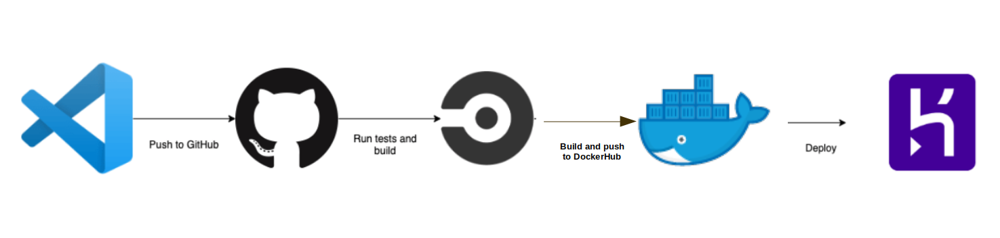
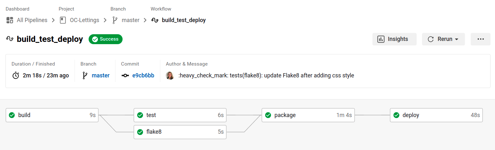

# openclassroom - projet 13 - Site web d'Orange County Lettings

| OC-Lettings |
|:----------:|

_Owner: [Amélie](https://github.com/ameliebnpp)_

## Developpement guide

### General informations

This project is developped with :
- Python(>=3.6, programming language),
- Django(web framework),
- Django REST(REST API framework),
- SQLite3(database)
- CircleCI for continuous integration
- Heroku for deployment
- Sentry for mo,itoring

### Installation

1. Check python/pip version/interpreteur

```bash
which python
python --version
which pip
```

2. Clone the project:

```bash
git clone --recursive git@github.com:amelieBNPP/OC-Lettings.git
```

3. Active the virtual environement:
```bash
python3 -m venv venv
source env/bin/activate
```
*The virtual environement is created only one time, however, it is activate each time we start to develop.*

### Dependencies

Install dependencies :

```bash
pip install -r requirements.txt
```

*Install dependancies each time we develop on this project.*

### Run server

Server can be run using the following commands:
```bash
cd /path/to/oc-lettings
source venv/bin/activate
pip install --requirement requirements.txt
python manage.py runserver
```

The API can be tested in local at the following adresse : http://127.0.0.1:8000/

### Admin

Django Administration will be used as a simple frontend : 
- launch server
- run : `http://localhost:8000/admin`
- connect with your supersUser identifiers (user:`admin`, password:`Abc1234!`)

#### DataBase

- `cd /path/to/oc-lettings`
- Open session `sqlite3`
- Connect to database `.open oc-lettings-site.sqlite3`
- Show tables in database `.tables`
- Show columns in profile table, `pragma table_info(oc_lettings_site_profile);`
- Lauch request on profile table, `select user_id, favorite_city from
  oc_lettings_site_profile where favorite_city like 'B%';`
- `.quit` for exit sql
### Test

1. Launch tests
To ensure new features do not add any regression in the code, run the tests with the following commands :
```bash
cd /path/to/oc-lettings
source venv/bin/activate
pytest
```
2. Coverage report
To ensure the tests coverage of the api we can use :
```bash
coverage run -m pytest
coverage report
# An HTML report allow to see code lines covered by tests in htmlcov/index.html file
coverage html
```

### Linting

```bash
cd /path/to/oc-lettings
source venv/bin/activate
flake8
```
### Docker

##### Run app locally

we assume that you have:

- a free [DockerHub account](https://hub.docker.com/)

To run the app locally: 
- `docker build -t oc_lettings .` create image
- `docker run -e DJANGO_SETTINGS_MODULE=config.settings -it -d -p 127.0.0.1:8000:8000 oc_lettings:latest` connect to our container and launch website
(`it` to be interactif, `-d` to be detach(backend), `-p`to define port to use)

The website is now available at the following adress : http://127.0.0.1:8000/

The website must look like:

##### Use the main Docker command line


* `docker images` show image available
* `docker ps` show container available
* `docker stop **CONTAINER ID**` stop container (if deamon error try the line below then `kill 1`)
* `docker exec -ti **CONTAINER ID** sh` to "go into" the docker container
* `docker rmi **IMAGE ID**` remove image
* `docker system prune` clean container, web, images...
* `docker login -u amefaure` connect to docker
* `docker build -t amefaure/oc_lettings:latest .` build format to share image
* `docker push amefaure/oc_lettings:latest` share image
* `docker pull amefaure/oc_lettings:latest` download image

### Deployment

we assume that you have:

- a free [Heroku account](https://signup.heroku.com/dc)
- install [Heroku and CLI](https://devcenter.heroku.com/articles/heroku-cli#install-the-heroku-cli)
- Python version 3.10 installed locally


- `heroku container:login` first we logging to the docker registery
- `heroku apps:create oc-lettings-openclassrooms` create an empty heroku app
- `heroku git:remote -a oc-lettings-openclassrooms` init git and set the heroku git remote to that repos
- `heroku container:push web` now we want to build the image and push it to the container registery
- `heroku container:release web -a oc-lettings-openclassrooms` and create a new release of the app
- `heroku open`to launch the api

The website is now available at the following adress : https://oc-lettings-openclassrooms.herokuapp.com/

**Command lines**
* `heroku config` to see saved configurations
* `heroku addons:add heroku-postgresql:hobby-dev`to attach database to postgresql database
* `heroku config:set SECRET_KEY=<your-secret-key>` 
* `heroku config:set ENV=PRODUCTION`
* `git push --force heroku master` to deploy when code is push to github
* `heroku logs --tail` to anayse logs
* `heroku apps` to list all projects
* `heroku apps:destroy` to delete api
* `docker tag amefaure/oc_lettings:latest registry.heroku.com/oc-lettings-openclassrooms/web` tag image to push to heroku
* `docker push registry.heroku.com/oc-lettings-openclassrooms/web` push image to heroku

### CicrcleCI

1. Define environement variables on CircleCI

* `DOCKERHUB_USER`: username of dockerhub account
* `DOCKERHUB_PASSWORD`: password of dockerhub account
* `HEROKU_APP_NAME`: name given to the api
* `HEROKU_API_KEY`: api_key to retreive on Heroku website

2. Workflow

The workflow is defined as following:


- build:
  - create virtual environement
  - active it
  - save it thank to cache
- tests after the job build is successfully completed:
  - all views
  - all urls
  - all models
- Flake8 after the job build is successfully completed:
  - ensure flake8 is OK
- Package after the jobs flake8/tests are successfully completed:
  - create image
  - push it on DockerHUb
- Deploy after the job deploy is successfully completed:
  - pull image from docker
  - tag it
  - push it to heroku
  - release app

The file `.circleCI/config.yml` describe jobs to complete this flow.


### Sentry

Sentry's Python SDK enables automatic reporting of errors and exceptions as well as identifies performance issues in your application.

If you have a new project, this command will create de SENTRY_DSN environement variable and link sentry to Heroku : 
```bash
heroku addons:create sentry:f1
```
Otherwise, if project already existe you can just add the environement variable :
```bash
heroku config:set SENTRY_DSN='<SENTRY_DSN>'
```

You can test sentry with the navigation page `/sentry-debug`. The error will be propagate to sentry via Heroku.


### Sources

- tests : https://openclassrooms.com/fr/courses/7155841-testez-votre-projet-python/7414181-implementez-vos-tests-pour-framework-django-avec-pytest-django
- docker : https://www.youtube.com/watch?v=dU5112nqViY
https://www.youtube.com/watch?v=ZgRkGfoy2nE
- Starting with Heroku : https://devcenter.heroku.com/articles/getting-started-with-python
- Starting with CicleCI : https://circleci.com/docs/
- Starting with Sentry : https://sentry.io/for/python/
